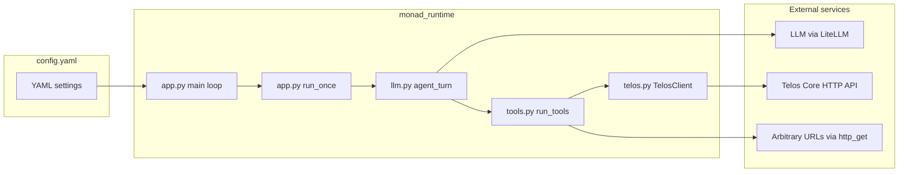

# monad-template — Architecture

This document explains **how the template is put together** so you can read `monad.py`, `monad_runtime/`, and `config.yaml` with confidence. No prior knowledge of Telos or LiteLLM is assumed.

---

## 1. What problem does this solve?

You want a small, long-running **agent** that:

- Uses an **LLM** to reason.
- Reads and writes **shared memory** in **Telos** (semantic search + new entries).
- Optionally fetches **public HTTP** URLs when the model decides it needs external context.

The template implements that as a **thin entrypoint** (`monad.py`) plus a small runtime package (`monad_runtime/`) and **one configuration file** (`config.yaml`). **Secrets** (API keys) stay in **environment variables**; everything else is declared in YAML.

---

## 2. Big picture

- **`config.yaml`** drives behavior: prompts, Telos URL, limits, tool descriptions.
- **`monad.py`** is only the entrypoint.
- **`monad_runtime/`** wires the **LLM** to **tools**; the **model chooses** when to call each tool (not a fixed script).

---

## 3. The three layers of control flow

Think of the program as three nested loops.

### Layer A — Process lifetime (`main()`)

1. **`load_config()`** — Reads `config.yaml` from disk **every iteration**. You can edit YAML while the process runs; the next cycle picks up changes.
2. **`run_once()`** — Performs **one full “mission”**: validate settings, talk to the LLM with tools, then return how many seconds to sleep.
3. **`sleep(interval_sec)`** — Waits before the next mission.

If **`run_once()`** raises an exception, the code logs it and still sleeps using **`interval_sec`** from the last loaded config so the daemon does not spin on errors.

### Layer B — One mission (`run_once()`)

1. **`validate_config()`** — Ensures required keys exist (see `_REQUIRED_KEYS` in code) and types are usable. On failure, the process **exits** with a log message.
2. **`TelosClient(...)`** — Opens an `httpx` session to **`telos_base_url`**, scoped by **`monad_id`** (Telos tags memories per agent id).
3. **Chat seed** — Builds the initial messages:
   - **System**: `system_prompt`
   - **User**: `task`
4. **`agent_turn(...)`** — Runs the LLM/tool dialogue (next layer).
5. **Close** the Telos client.

### Layer C — LLM and tools (`agent_turn()`)

This is **function calling** (OpenAI-style tools) via **LiteLLM** `completion(..., tools=..., tool_choice=..., parallel_tool_calls=...)`. The first round’s `tool_choice` comes from **`config.yaml`** (default `auto`); later rounds use **`auto`** so the model can answer in plain text after tool results.

Repeated up to **`max_tool_rounds`** times:

1. Send the **current message list** + **tool definitions** to the LLM. Tool definitions are built by **`build_tools()`** from **`tool_descriptions`** in `config.yaml`.
2. **If the model returns no tool calls** — The mission’s LLM turn is **done** (the model may answer in natural language).
3. **If the model returns tool calls** — For each call, **`run_tools()`** executes:
   - **`telos_search`** → `TelosClient.search` → `POST /api/v1/search`
   - **`telos_write`** → `TelosClient.write` → `POST /api/v1/write`
   - **`http_get`** → short `httpx` GET, optionally restricted by **`fetch_allowed_hosts`**
4. Append each result as a **`role: "tool"`** message (with the matching **`tool_call_id`**).
5. **Call the LLM again** with the expanded history so it can use the results or call more tools.

**`max_tool_rounds`** caps how many LLM invocations occur per mission, preventing runaway cost if the model loops.

---

## 4. Where each piece of logic lives

| Symbol | Responsibility |
|--------|----------------|
| `monad_runtime/config.py` | Parse and validate `config.yaml`. |
| `monad_runtime/telos.py` | HTTP to Telos; retries on **429** with sleep from config. |
| `monad_runtime/tools.py` | Tool schema and tool execution (`telos_*`, `http_get`). |
| `monad_runtime/llm.py` | Multi-step LLM loop with tools until done or cap. |
| `monad_runtime/app.py` | `run_once()` and `main()` outer loop. |

---

## 5. Configuration vs. secrets

| Source | Typical content |
|--------|------------------|
| **`config.yaml`** | `telos_base_url`, `monad_id`, `llm_model`, prompts, limits, `tool_descriptions`, `fetch_allowed_hosts`, `tool_choice`, `parallel_tool_calls` |
| **Environment** | `OPENAI_API_KEY`, or other provider keys required by **`llm_model`** |
| **`.env`** (optional) | Same as environment; loaded from the template directory at import time via **`python-dotenv`**. Existing shell variables win (`override=False`). |

Telos base URL is **not** read from environment variables in this template — it is **only** `telos_base_url` in YAML, so a single file describes connectivity.

---

## 6. Telos API mapping

| Tool | HTTP | Purpose |
|------|------|---------|
| `telos_search` | `POST /api/v1/search` | Semantic search; body includes `monad_id`, `query`, `limit`. |
| `telos_write` | `POST /api/v1/write` | Store text; optional `parent_ids` to link to prior nodes. |

Search result size is clamped using **`default_search_limit`**, **`max_search_limit`**, and the per-call `limit` argument from the model.

---

## 7. Extending safely

- **New tools** — Add a schema in **`build_tools()`**, a branch in **`run_tools()`**, and (optionally) new keys in `config.yaml` for descriptions or endpoints.
- **Stricter HTTP** — Set **`fetch_allowed_hosts`** to a non-empty list of hostnames; empty list means **no host restriction** for `http_get` (development-friendly, risky in production).

---

## 8. Mental model in one sentence

**`main` reloads config, runs one LLM-driven tool session against Telos (and optional HTTP), sleeps, and repeats — with the LLM deciding the tool sequence, not the template.**

For a shorter overview that overlaps with this doc, see the **“How monad.py works”** section in `README.md`.
